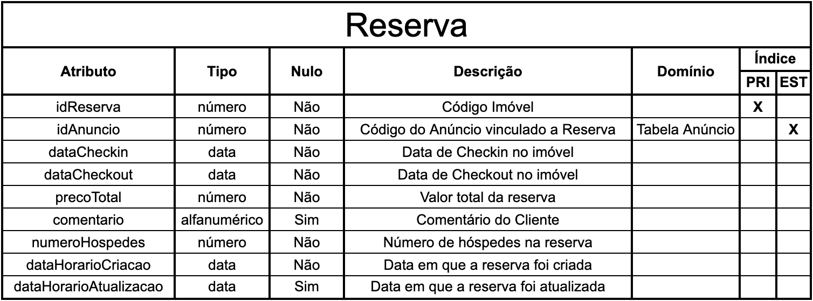
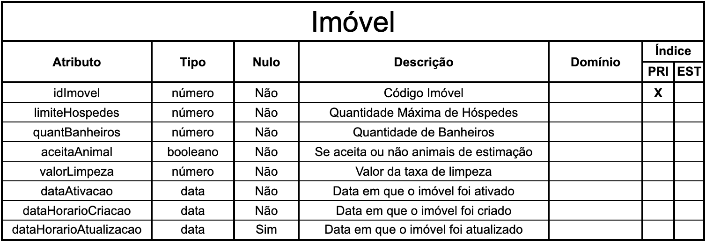
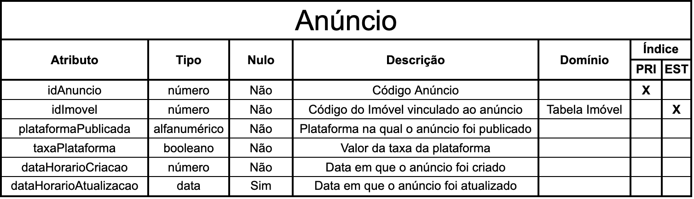

# Khanto Rent

Este projeto tem por objetivo testar habilidades na documentação, escrita de código e testes.

## Começando

Nesta seção, você encontrará instruções detalhadas para configurar e executar uma cópia local do projeto Khanto Rent 
na sua máquina, permitindo que você o teste e o explore facilmente.

Consulte **Inicialização** para saber como inicializar o projeto.

## Arquitetura do Sistema

* O Khanto Rent segue uma arquitetura baseada no padrão Model-Template-View (MTV) do Django, 
com a aplicação de um modelo de dados robusto e a exposição de uma API RESTful para interações externas.

## Modelagem dos Dados

A modelagem dos dados é um dos pontos-chave do sistema, 
permitindo a representação e a manipulação eficiente dos dados que serão inseridos, 
dando uma ideia de como iremos construir todo o sistema. O diagrama abaixo ilustra a estrutura dos modelos de dados:








## Estrutura do Projeto

* O projeto está estruturado em alguns diretórios principais, visando a construção de um código robusto, 
com o princípio de responsabilidade única, facilitando a manutenção e a escalabilidade:
  
  * **app/**: Diretório da Aplicação Principal 
    * **migrations/**: Arquivos de Alteração do Banco
    * **tests/**: Arquivos de Testes
    * **views/**: Views referentes a cada endpoint da API
  * **fixture/**: Arquivos para adicionar dados ao banco
  * * **seazone/**: Diretório raiz do Django

## Pré-requisitos

Antes de iniciar a configuração do projeto, certifique-se de ter as seguintes ferramentas instaladas:
```
Python
Django
Django Rest Framework
```

## Instalação

Uma série de exemplos passo-a-passo que informam o que você deve executar para ter um ambiente de desenvolvimento em execução.

Crie uma pasta com o nome da sua escolha e execute o comando:

```
python3 -m venv env
```

Logo após execute o comando:

```
source env/bin/activate
```

Clone o repositório git para seu ambiente local:

```
git clone https://github.com/danilo-soares/khonter-rent.git
```

Navegue ao diretório:

```
cd khanto-rent
```

Instale as dependências do projeto utilizando o pip:

```
pip install -r requirements.txt
```

Realize as migrações do banco de dados:

```
python manage.py migrate
```

Inicie o servidor de desenvolvimento:

```
python manage.py runserver
```

## Executando as fixtures

Para adicionar as fixtures, rodar os comandos abaixo em sequência:

```
python manage.py loaddata fixtures/imoveis_fixture.json
```

```
python manage.py loaddata fixtures/anuncio_fixture.json
```

```
python manage.py loaddata fixtures/reserva_fixture.json
```

## Executando os testes

Para rodar os testes, executar o comando abaixo

```
python3 manage.py test app.tests 
```

## Cobertura dos Testes

A cobertura de testes é extensivamente aplicada para verificar e validar os diferentes casos e cenários do sistema, 
assegurando sua robustez e confiabilidade. 
O comando abaixo pode ser rodado para verificar a cobertura dos testes no sistema.

```
coverage run manage.py test
```

## API'S

As API's estão divididas em:

```
imovel/ -> API para manipulação de Imóveis
anuncio/ -> API para manipulação de Anúncios
reserva/ -> API para manipulação de Imóveis
```

## Ferramentas Utilizadas

As ferramentas que foram utilizadas para criação desse projeto, foram:

* [Python](https://docs.python.org/pt-br/3.12/tutorial/)
* [Django](https://docs.djangoproject.com/pt-br/5.0/)
* [SQLite](https://www.sqlite.org/docs.html)
* [Django Rest Framework](https://www.django-rest-framework.org/)
* [GitHub](https://github.com/)

## Autor

* **Danilo Soares** - *Desenvolvedor Fullstack* - [Linkedin](https://www.linkedin.com/in/danilo-soaresc/)

